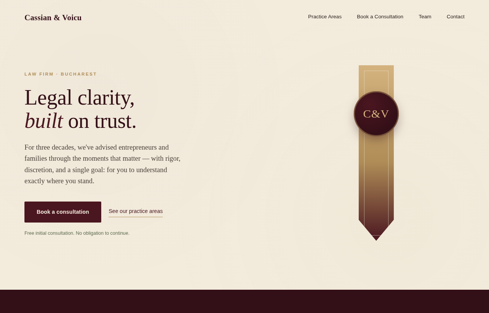
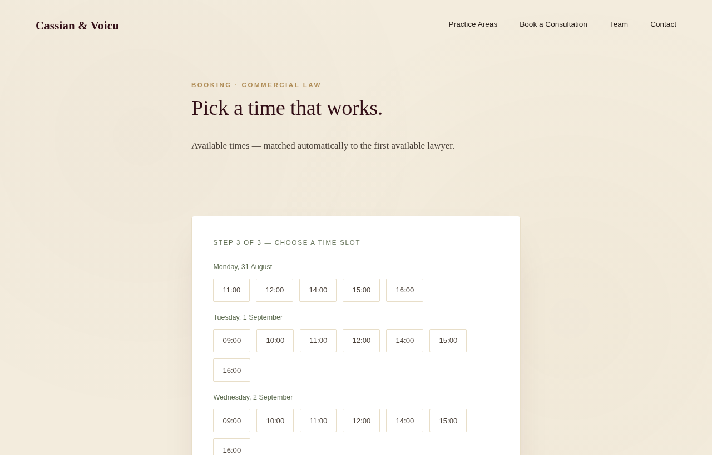
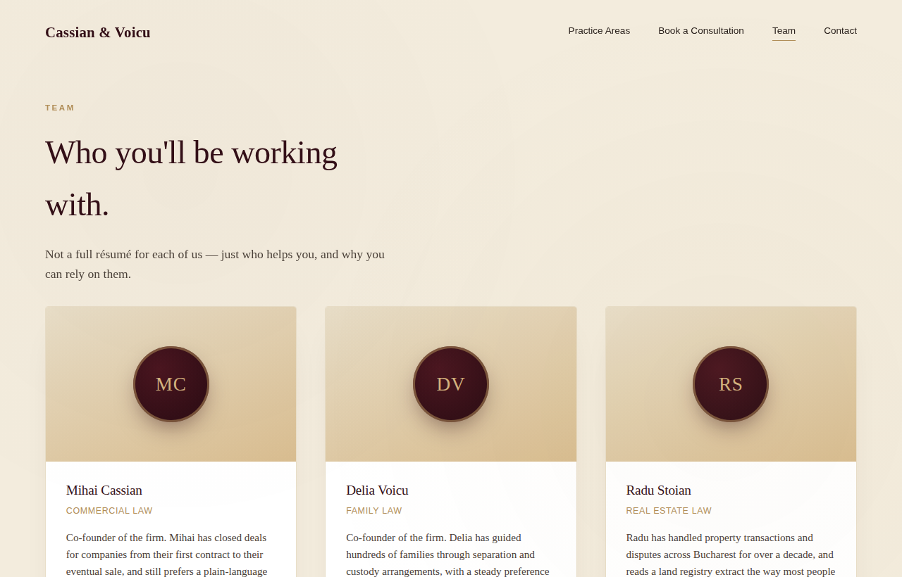
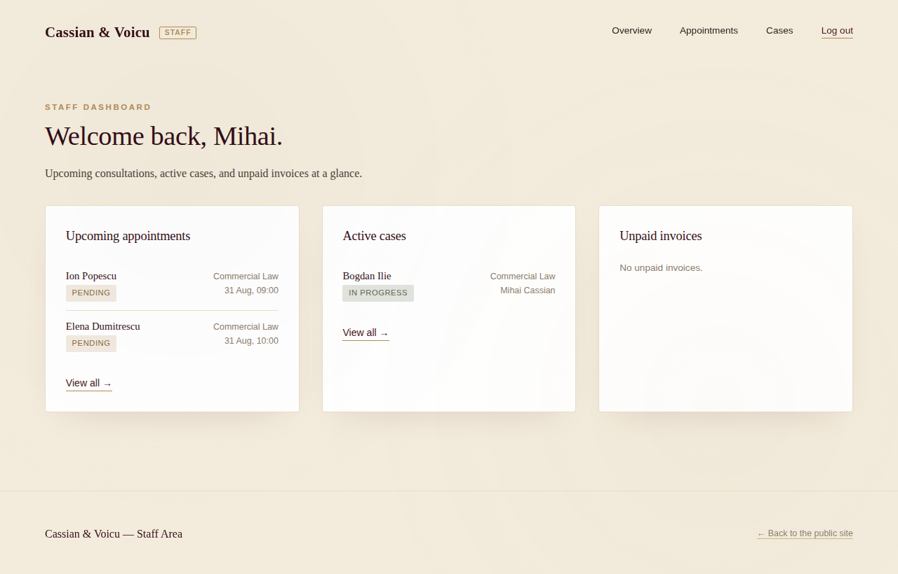

# Cassian & Voicu — Law Firm Website

A portfolio project: a Django website and booking system for a fictional law
firm, "Cassian & Voicu". Public marketing site + a functional consultation
booking flow backed by a database, plus an internal staff dashboard for
managing appointments and cases — no client accounts, no client portal.

## Screenshots

| Homepage | Booking flow |
|---|---|
|  |  |

| Team | Staff dashboard |
|---|---|
|  |  |

## Stack

Django 5, SQLite (default dev database), server-rendered templates (no SPA).

## Structure

- `pages` — homepage, contact page and message form
- `practice_areas` — the four practice areas (list + detail pages)
- `team` — lawyer profiles, each optionally linked to a staff login
- `booking` — the public consultation booking flow (practice area → lawyer →
  time slot → confirmation), with `transaction.atomic()` + `select_for_update()`
  and a database-level unique constraint to prevent double-booking the same
  lawyer and time slot
- `dashboard` — internal, login-only area for lawyers/staff: an overview of
  upcoming appointments, active cases and unpaid invoices; confirming,
  cancelling and rescheduling appointments (same double-booking protection as
  public booking); opening a case from a confirmed appointment; updating case
  status and uploading documents. A lawyer only sees their own appointments
  and cases — a superuser account sees everything.

## Getting started

```bash
python -m venv venv
source venv/bin/activate
pip install -r requirements.txt
python manage.py migrate
python manage.py createsuperuser
python manage.py runserver
```

Visit `http://127.0.0.1:8000/` for the public site, `/dashboard/` for the
staff area, and `/admin/` for the Django admin.

### Demo data

Data migrations automatically seed the four practice areas, one lawyer per
area, and one demo case with an invoice, so the site isn't empty on first
run. Each seeded lawyer also gets a staff login for the dashboard, all with
the same demo password — **change this before any real deployment**:

| Username | Password | Lawyer |
|---|---|---|
| `mihai.cassian` | `demo12345` | Commercial Law |
| `delia.voicu` | `demo12345` | Family Law |
| `radu.stoian` | `demo12345` | Real Estate Law |
| `ana.petrescu` | `demo12345` | Civil Litigation |

For full visibility across every lawyer's appointments and cases, use a
superuser account (`createsuperuser`) instead.

## Configuration / deployment

Settings are read from environment variables (via a local `.env` file in
development, or real environment variables from the host in production).
Copy `.env.example` to `.env` and fill it in:

- `DJANGO_SECRET_KEY` — generate one with
  `python -c "from django.core.management.utils import get_random_secret_key; print(get_random_secret_key())"`
- `DJANGO_DEBUG` — `True` locally, `False` in any real deployment
- `DJANGO_ALLOWED_HOSTS`, `DJANGO_CSRF_TRUSTED_ORIGINS` — required once
  `DJANGO_DEBUG=False`

With `DJANGO_DEBUG=False`, HTTPS-only cookie and HSTS settings turn on
automatically — see `config/settings.py`. The demo staff passwords above are
fine for a portfolio demo but are public (they're in this README) — change
them before pointing this at any real client data.
